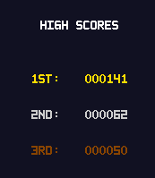

Tower defense game written for the Basys3 Artix-7 FPGA.
Simulate the VGA output locally with `make run`, requires Verilator and SDL2.
Controls in the simulation are WASD for cursor movement, E for interaction, 1 for pausing, 2/3 for increasing/decreasing game speed, and 4 for ending a game.
Interact with an empty grid slot to place a tower, or interact with a placed tower to upgrade/sell it.
Exit menus using A or S for tower selection/upgrading, E otherwise.

